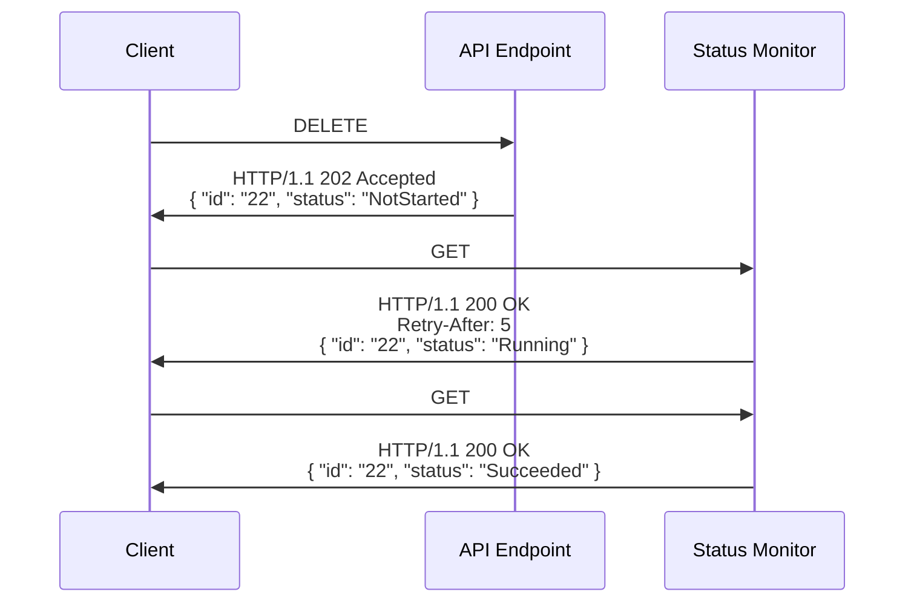
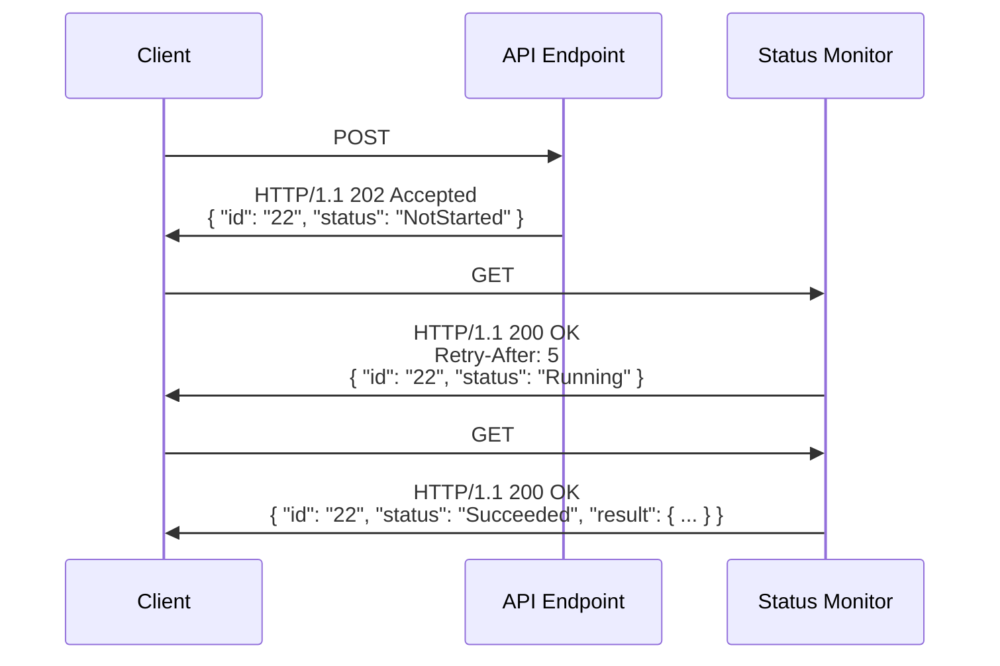

# Những điều cần cân nhắc khi thiết kế dịch vụ

<!-- cspell:ignore autorest, etag, idempotency, maxpagesize, openapi -->
<!-- markdownlint-disable MD033 -->

## Lịch sử

| Ngày        | Ghi chú                                                        |
| ----------- | -------------------------------------------------------------- |
| 2024-Mar-17 | Cập nhật hướng dẫn về LRO                                      |
| 2024-Jan-17 | Bổ sung hướng dẫn về việc trả về offset và độ dài của chuỗi    |
| 2022-Jul-15 | Cập nhật hướng dẫn về thao tác chạy lâu                        |
| 2022-Feb-01 | Cập nhật hướng dẫn về lỗi                                      |
| 2021-Sep-11 | Bổ sung hướng dẫn về thao tác chạy lâu                         |
| 2021-Aug-06 | Cập nhật Azure REST Guidelines theo Azure API Stewardship Board. |

## Giới thiệu

API tốt giúp dịch vụ của bạn dễ sử dụng đối với khách hàng. Chúng trực quan, phản ánh và truyền đạt một cách tự nhiên mô hình bên dưới cùng hành vi của nó. Chúng dễ dàng được triển khai thành client library trên nhiều ngôn ngữ lập trình. Và chúng không "cản trở" nhà phát triển, nhờ giữ được sự ổn định và khả năng dự đoán, _đặc biệt là theo thời gian_.

Tài liệu này cung cấp cho các nhóm Microsoft đang xây dựng dịch vụ Azure một tập hướng dẫn giúp các nhóm dịch vụ xây dựng những API tốt. Các hướng dẫn này tạo ra những API dễ tiếp cận, bền vững và nhất quán trên toàn nền tảng Azure. Chúng tôi làm điều này bằng cách áp dụng một tập mẫu thiết kế và chuẩn web chung vào việc thiết kế và phát triển API.
Đối với nhà phát triển, một API được định nghĩa và xây dựng tốt cho phép họ xây dựng các ứng dụng có khả năng chịu lỗi, dễ bảo trì, hỗ trợ và mở rộng. Đối với các nhóm dịch vụ Azure, API thường là nguồn để sinh mã, giúp phục vụ nhiều nhà phát triển trên nhiều ngôn ngữ.

Các nhóm dịch vụ Azure nên làm việc với Azure HTTP/REST Stewardship Board từ sớm trong vòng đời phát triển để được hướng dẫn, thảo luận và rà soát API của mình. Ngoài ra, thực hành tốt là thực hiện rà soát bảo mật, đặc biệt nếu bạn lo ngại về rò rỉ PII, việc tuân thủ GDPR, hoặc bất kỳ cân nhắc nào khác liên quan đến tình huống của bạn.

Điều cực kỳ quan trọng là thiết kế dịch vụ của bạn sao cho không làm gián đoạn người dùng khi API phát triển:

<a href="#principles-api-versioning" name="principles-api-versioning">:white_check_mark:</a> **DO** triển khai đánh phiên bản API ngay từ bản phát hành đầu tiên của dịch vụ.

<a href="#principles-compatibility" name="principles-compatibility">:white_check_mark:</a> **DO** đảm bảo các workload của khách hàng không bao giờ bị hỏng

<a href="#principles-backward-compatibility" name="principles-backward-compatibility">:white_check_mark:</a> **DO** đảm bảo khách hàng có thể chuyển sang phiên bản mới của dịch vụ hoặc của SDK client library **mà không cần thay đổi mã**

## Azure Management Plane và Data Plane
_Lưu ý: Việc phát triển một dịch vụ mới đòi hỏi phải phát triển ít nhất 1 API (management plane) và có thể thêm một hoặc nhiều API (data plane) khác.  Khi rà soát các API dịch vụ v1, chúng tôi thấy có những lời khuyên phổ biến được đưa ra trong quá trình rà soát._

API **management plane** được triển khai thông qua Azure Resource Manager (ARM) và được dùng để cung cấp (provision) và kiểm soát trạng thái vận hành của các resource.
API **data plane** được nhà phát triển dùng để xây dựng ứng dụng. Đôi khi, một số thao tác hữu ích cho cả việc cung cấp/kiểm soát lẫn ứng dụng. Trong trường hợp này, thao tác có thể xuất hiện trong cả hai API.
Mặc dù các thực hành tốt nhất và mẫu thiết kế được mô tả trong tài liệu này áp dụng cho mọi API HTTP/REST, chúng đặc biệt quan trọng đối với các dịch vụ **data plane** vì đây là giao diện chính cho nhà phát triển sử dụng dịch vụ của bạn. API **management plane** có thể có những thực hành ưu tiên khác dựa trên các quy ước của [Azure RPC](https://aka.ms/azurerpc).

## Bắt đầu từ trải nghiệm của nhà phát triển
Một API tốt bắt đầu từ một dịch vụ được suy nghĩ và thiết kế kỹ lưỡng. Dịch vụ của bạn nên định nghĩa các abstraction đơn giản/dễ hiểu, mỗi abstraction có một tên rõ ràng mà bạn dùng nhất quán xuyên suốt API và tài liệu. Cũng phải có mối quan hệ rõ ràng, không mơ hồ giữa các abstraction này.

Hãy làm theo các thực hành sau để đặt tên rõ ràng cho các abstraction của bạn:
- Đừng sáng tạo ra những thuật ngữ cầu kỳ hay dùng từ ngữ hoa mỹ. Hãy thử giải thích abstraction cho một người không phải chuyên gia trong lĩnh vực, rồi đặt tên cho abstraction bằng cách diễn đạt tương tự.
- Đừng đưa các từ "thừa" vào tên, như "response", "object", "payload", v.v.
- Tránh các tên chung chung. Tên nên cụ thể cho abstraction và làm nổi bật điểm khác biệt của nó so với các abstraction khác trong dịch vụ của bạn hoặc các dịch vụ liên quan.
- Chọn một từ/thuật ngữ trong một tập từ đồng nghĩa và dùng nhất quán từ đó.

Rất khó để tạo ra một API thanh lịch hoạt động tốt trên nền một dịch vụ được thiết kế kém; nhóm dịch vụ và khách hàng sẽ phải chịu nỗi khó khăn này trong nhiều năm. Vì vậy, nhóm dịch vụ nên đồng cảm với khách hàng bằng cách:
- Xây dựng các ứng dụng sử dụng API
- Tổ chức các buổi rà soát và chia sẻ những gì học được với nhóm của bạn
- Thu thập phản hồi của khách hàng từ các bản preview của API
- Suy nghĩ về đoạn mã mà khách hàng viết cả trước và sau một thao tác HTTP
- Khởi tạo và đọc từ các cấu trúc dữ liệu mà dịch vụ của bạn yêu cầu
- Suy nghĩ xem những lỗi nào có thể khắc phục được lúc chạy, so với những lỗi cho thấy một bug trong mã của khách hàng mà phải được sửa

Toàn bộ mục đích của bản preview là xử lý phản hồi bằng cách cải thiện các abstraction, cách đặt tên, các mối quan hệ, các thao tác API, v.v. Việc thực hiện breaking change trong giai đoạn preview là chấp nhận được để cải thiện trải nghiệm ngay bây giờ, nhờ đó nó bền vững về lâu dài.

## Tập trung vào các kịch bản trọng tâm
Điều quan trọng là nhận ra rằng viết một API, trong nhiều trường hợp, là phần dễ nhất của việc mang lại trải nghiệm tuyệt vời cho nhà phát triển. Có rất nhiều hoạt động hạ nguồn cho mỗi API, ví dụ: kiểm thử, tài liệu, client library, ví dụ, bài blog, video, và hỗ trợ khách hàng vĩnh viễn. Trên thực tế, chi phí triển khai một API là rất nhỏ so với tất cả các hoạt động hạ nguồn khác.

_Vì lý do này, **tốt hơn nhiều** là phát hành với ít tính năng hơn và chỉ bổ sung tính năng mới theo thời gian khi khách hàng yêu cầu._

Tập trung vào các kịch bản trọng tâm giúp giảm chi phí phát triển, hỗ trợ và bảo trì; giúp các nhóm thống nhất và đạt đồng thuận nhanh hơn; và đẩy nhanh thời gian giao sản phẩm. Dấu hiệu dễ nhận thấy của một dịch vụ chưa tập trung vào các kịch bản trọng tâm là "API drift", khi các endpoint thiếu nhất quán, không đầy đủ, hoặc đặt cạnh nhau một cách chắp vá.

<a href="#hero-scenarios-design" name="hero-scenarios-design">:white_check_mark:</a> **DO** định nghĩa các "kịch bản trọng tâm" trước, bao gồm abstraction, cách đặt tên, các mối quan hệ, rồi sau đó định nghĩa API mô tả các thao tác cần thiết.

<a href="#hero-scenarios-examples" name="hero-scenarios-examples">:white_check_mark:</a> **DO** cung cấp mã ví dụ minh họa các "kịch bản trọng tâm".

<a href="#hero-scenarios-high-level-languages" name="hero-scenarios-high-level-languages">:white_check_mark:</a> **DO** cân nhắc cách các abstraction của bạn sẽ được biểu diễn trong các ngôn ngữ bậc cao khác nhau.

<a href="#hero-scenarios-hll-examples" name="hero-scenarios-hll-examples">:white_check_mark:</a> **DO** viết các ví dụ mã bằng ít nhất một ngôn ngữ định kiểu động (ví dụ Python hoặc JavaScript) và một ngôn ngữ định kiểu tĩnh (ví dụ Java hoặc C#) để minh họa các abstraction của bạn và cách biểu diễn chúng trong ngôn ngữ bậc cao.

<a href="#hero-scenarios-yagni" name="hero-scenarios-yagni">:no_entry:</a> **DO NOT** chủ động thêm API cho các tính năng mang tính suy đoán mà khách hàng có thể muốn.

### Bắt đầu từ định nghĩa API của bạn
Việc hiểu dịch vụ của bạn được sử dụng như thế nào và định nghĩa mô hình cũng như các mẫu tương tác của nó--tức là API của nó--nên là một trong những hoạt động sớm nhất mà một nhóm dịch vụ thực hiện. Nó phản ánh các quyết định về abstraction và cách đặt tên, và giúp nhà phát triển dễ dàng triển khai các kịch bản trọng tâm.

<a href="#openapi-description" name="openapi-description">:white_check_mark:</a> **DO** tạo một [mô tả OpenAPI](https://github.com/OAI/OpenAPI-Specification/blob/main/versions/2.0.md) (kèm [autorest extensions](https://github.com/Azure/autorest/blob/master/docs/extensions/readme.md)) cho API của dịch vụ. Mô tả OpenAPI là một thành phần then chốt của kế hoạch Azure SDK và là điều thiết yếu cho tài liệu, khả năng sử dụng và khả năng khám phá của các API dịch vụ.

## Thiết kế để chịu được thay đổi
Khi xây dựng dịch vụ và API của bạn, có một số quyết định có thể đưa ra ngay từ đầu để tăng khả năng chịu được thay đổi cho các triển khai phía client. Xử lý những vấn đề này càng sớm càng tốt sẽ giúp bạn lặp nhanh hơn và tránh breaking change.

<a href="#resiliency-enums" name="resiliency-enums">:ballot_box_with_check:</a> **YOU SHOULD** dùng enum có thể mở rộng. Enum có thể mở rộng được mô hình hóa dưới dạng chuỗi - việc mở rộng một enum có thể mở rộng không phải là breaking change.

<a href="#resiliency-conditional-requests" name="resiliency-conditional-requests">:ballot_box_with_check:</a> **YOU SHOULD** triển khai [conditional request](https://tools.ietf.org/html/rfc7232) từ sớm. Điều này cho phép bạn hỗ trợ concurrency, vốn thường trở thành mối quan tâm về sau.

## Sử dụng tên gọi tốt

Tên gọi tốt cho resource, thuộc tính, thao tác và tham số là điều thiết yếu để có trải nghiệm nhà phát triển tuyệt vời.

Resource được mô tả bằng danh từ. Tên resource và tên thuộc tính phải mang tính mô tả và dễ hiểu đối với khách hàng.
Hãy dùng những tên tương ứng với các kịch bản của người dùng thay vì các chi tiết triển khai của dịch vụ, ví dụ: "Diagnosis" chứ không phải "TreeLeafNode".
Tên nên truyền tải mục đích của giá trị chứ không chỉ mô tả cấu trúc của nó, ví dụ: "ConfigurationSetting" chứ không phải "KeyValuePair".
Sự dễ hiểu đến từ sự quen thuộc và khả năng nhận biết; bạn nên ưu tiên sự nhất quán với các dịch vụ Azure khác, với tên trong portal/giao diện người dùng của sản phẩm, và với các chuẩn của ngành.

Tên nên giúp nhà phát triển khám phá chức năng mà không phải liên tục tham khảo tài liệu.
Hãy dùng các mẫu thiết kế phổ biến và quy ước chuẩn để giúp nhà phát triển đoán đúng tên và ý nghĩa của các thuộc tính thông dụng.
Hãy dùng cách đặt tên đầy đủ, rõ nghĩa và tránh viết tắt, trừ các từ viết tắt
được biết đến rộng rãi trong lĩnh vực dịch vụ của bạn.

<a href="#naming-consistency" name="naming-consistency">:white_check_mark:</a> **DO** dùng cùng một tên cho cùng một khái niệm và các tên khác nhau cho các khái niệm khác nhau, bất cứ khi nào có thể.

### Quy ước đặt tên được khuyến nghị

Sau đây là các quy ước đặt tên được khuyến nghị cho các dịch vụ Azure:

<a href="#naming-collections" name="naming-collections">:white_check_mark:</a> **DO** đặt tên collection bằng danh từ số nhiều hoặc cụm danh từ số nhiều, dùng tiếng Anh đúng ngữ pháp.

<a href="#naming-values" name="naming-values">:white_check_mark:</a> **DO** đặt tên các giá trị không phải là collection bằng danh từ số ít hoặc cụm danh từ số ít.

<a href="#naming-adjective-before-noun" name="naming-adjective-before-noun">:ballot_box_with_check:</a> **YOU SHOULD** đặt tính từ trước danh từ trong các tên chứa cả danh từ và tính từ.

Ví dụ, `collectedItems` chứ không phải `itemsCollected`

<a href="#naming-acronym-case" name="naming-acronym-case">:ballot_box_with_check:</a> **YOU SHOULD** viết hoa/thường các từ viết tắt như các từ thông thường (tức là lower camelCase).

Ví dụ, `nextUrl` chứ không phải `nextURL`.

<a href="#naming-date-time" name="naming-date-time">:ballot_box_with_check:</a> **YOU SHOULD** dùng hậu tố "At" trong tên của các giá trị `date-time`.

Ví dụ, `createdAt` chứ không phải `created` hay `createdDateTime`.

<a href="#naming-include-units" name="naming-include-units">:ballot_box_with_check:</a> **YOU SHOULD** dùng hậu tố là đơn vị đo cho các giá trị có đơn vị đo rõ ràng (chẳng hạn byte, dặm, v.v.). Hãy dùng chữ viết tắt được chấp nhận rộng rãi cho đơn vị (ví dụ "Km" thay vì "Kilometers") khi phù hợp.

<a href="#naming-duration" name="naming-duration">:ballot_box_with_check:</a> **YOU SHOULD** dùng kiểu int cho khoảng thời gian và đưa đơn vị thời gian vào tên.

Ví dụ, `expirationDays` kiểu `int` chứ không phải `expiration` kiểu `date-time`.

<a href="#naming-brand-names" name="naming-brand-names">:warning:</a> **YOU SHOULD NOT** dùng tên thương hiệu trong tên resource hoặc tên thuộc tính.

<a href="#naming-avoid-acronyms" name="naming-avoid-acronyms">:warning:</a> **YOU SHOULD NOT** dùng từ viết tắt hoặc chữ rút gọn trừ khi chúng được hiểu rộng rãi, ví dụ "ID" hoặc "URL", nhưng không dùng "Num" cho "number".

<a href="#naming-avoid-reserved-words" name="naming-avoid-reserved-words">:warning:</a> **YOU SHOULD NOT** dùng các tên là từ khóa dành riêng trong các ngôn ngữ lập trình được dùng rộng rãi (gồm C#, Java, JavaScript/TypeScript, Python, C++ và Go).

<a href="#naming-boolean" name="naming-boolean">:no_entry:</a> **DO NOT** dùng tiền tố "is" trong tên của các giá trị `boolean`, ví dụ "enabled" chứ không phải "isEnabled".

<a href="#naming-avoid-redundancy" name="naming-avoid-redundancy">:no_entry:</a> **DO NOT** dùng các từ thừa trong tên.

Ví dụ, `/phones/number` chứ không phải `phone/phoneNumber`.

### Các tên thông dụng

Sau đây là các tên được khuyến nghị cho các thuộc tính khớp với mô tả tương ứng:

| Tên | Mô tả |
|------------- | --- |
| createdAt | Ngày và giờ resource được tạo. |
| lastModifiedAt | Ngày và giờ resource được sửa đổi lần cuối. |
| deletedAt | Ngày và giờ resource bị xóa. |
| kind   | Giá trị discriminator cho một resource đa hình |
| etag | Entity tag dùng cho kiểm soát đồng thời lạc quan (optimistic concurrency), khi được đưa vào làm thuộc tính của một resource. |

### `name` so với `id`

<a href="#naming-name-vs-id" name="naming-name-vs-id">:white_check_mark:</a> **DO** dùng hậu tố "Id" cho tên của định danh của một resource.

Điều này vẫn đúng ngay cả khi định danh do người dùng gán bằng phương thức PUT/PATCH.

## Sử dụng bản preview để lặp
Trước khi phát hành, hãy lên kế hoạch cho API để đầu tư công sức thiết kế đáng kể, thu thập phản hồi của khách hàng, và lặp qua nhiều bản preview. Điều này đặc biệt quan trọng với V1 vì nó thiết lập các abstraction và mẫu thiết kế mà nhà phát triển sẽ dùng để tương tác với dịch vụ của bạn.

<a href="#previews-hypotheses" name="previews-hypotheses">:ballot_box_with_check:</a> **YOU SHOULD**  viết và kiểm chứng các giả thuyết về cách khách hàng sẽ sử dụng API.

<a href="#previews-at-least-two" name="previews-at-least-two">:ballot_box_with_check:</a> **YOU SHOULD**  phát hành và đánh giá tối thiểu 2 phiên bản preview trước bản GA đầu tiên.

<a href="#previews-key-scenarios" name="previews-key-scenarios">:ballot_box_with_check:</a> **YOU SHOULD**  xác định các kịch bản chính hoặc các quyết định thiết kế trong API mà bạn muốn kiểm thử với khách hàng, và đề nghị khách hàng phản hồi cũng như chia sẻ các mẫu mã liên quan.

<a href="#previews-code-with" name="previews-code-with">:ballot_box_with_check:</a> **YOU SHOULD**  cân nhắc thực hiện một buổi _code with_, trong đó bạn trực tiếp phát triển cùng khách hàng, quan sát và học hỏi từ cách họ sử dụng API.

<a href="#previews-share-results" name="previews-share-results">:ballot_box_with_check:</a> **YOU SHOULD**  ghi lại những gì bạn đã học được trong giai đoạn preview và chia sẻ những phát hiện này với nhóm của bạn và với API Stewardship Board.

## Thông báo về việc ngừng hỗ trợ
Khi dịch vụ của bạn phát triển theo thời gian, việc bạn muốn loại bỏ các thao tác không còn cần thiết là điều tự nhiên. Ví dụ, các yêu cầu bổ sung hoặc khả năng mới của dịch vụ có thể đã dẫn đến một thao tác mới mà trên thực tế thay thế một thao tác cũ.
Azure có chính sách breaking change đã được thiết lập rõ ràng, mô tả cách tiếp cận những thay đổi kiểu này. Theo chính sách này, nhóm dịch vụ bắt buộc phải thông báo rõ ràng cho khách hàng khi API của họ thay đổi, ví dụ khi ngừng hỗ trợ các thao tác. Thông thường, việc này được thực hiện qua email gửi đến địa chỉ gắn với subscription Azure.

Tuy nhiên, do cách nhiều tổ chức được cấu trúc, địa chỉ email này thường khác với những người thực sự viết mã gọi API của bạn. Để giải quyết vấn đề này, API của dịch vụ nên khai báo rằng nó có thể trả về header `azure-deprecating`, nhằm cho biết thao tác này sẽ bị loại bỏ trong tương lai. Có một quy ước chuỗi đơn giản, được nêu trong [Azure REST API Guidelines](https://aka.ms/azapi/guidelines#deprecating-behavior-notification), cung cấp thêm thông tin về việc ngừng hỗ trợ sắp tới.
Header này nhắm đến nhà phát triển hoặc các chuyên gia vận hành, và nhằm cung cấp cho họ đủ thông tin cũng như thời gian chuẩn bị để thích ứng đúng cách với thay đổi này. Tài liệu của bạn nên tham chiếu đến header này và khuyến khích các thực hành ghi log và cảnh báo dựa trên sự xuất hiện của nó.

## Tránh gây bất ngờ
Một trở ngại lớn đối với việc áp dụng và sử dụng là khi một API hoạt động theo cách không mong đợi. Thông thường, đó là những quyết định thiết kế tinh tế mà lúc đó có vẻ vô hại, nhưng cuối cùng lại gây ra ma sát đáng kể ở hạ nguồn đối với nhà phát triển.

Một lĩnh vực phổ biến gây ma sát cho nhà phát triển là _đa hình_ -- khi một giá trị có thể có bất kỳ kiểu hoặc cấu trúc nào trong số nhiều kiểu hoặc cấu trúc.
Đa hình có thể có lợi trong một số trường hợp, ví dụ như một cách biểu đạt tính kế thừa, nhưng cũng gây ma sát vì nó đòi hỏi giá trị phải được kiểm tra (introspect) trước khi xử lý và không thể được biểu diễn theo cách tự nhiên/hữu ích trong nhiều ngôn ngữ định kiểu danh nghĩa. Việc dùng trường discriminator (`kind`) giúp đơn giản hóa việc kiểm tra, nhưng nhà phát triển thường vẫn phải ép kiểu response một cách tường minh sang kiểu phù hợp để sử dụng.

Collection là một lĩnh vực phổ biến khác gây ma sát cho nhà phát triển. Điều quan trọng là định nghĩa collection theo cách nhất quán trong dịch vụ của bạn và giữa các dịch vụ của nền tảng.  Cụ thể, các tính năng như phân trang, lọc và sắp xếp, khi được hỗ trợ, nên tuân theo các mẫu API chung. Xem [Collections](./Guidelines.md#collections) để biết hướng dẫn cụ thể.

Một cân nhắc quan trọng khi định nghĩa một dịch vụ mới là hỗ trợ phân trang.

<a href="#support-paging" name="support-paging">:ballot_box_with_check:</a> **YOU SHOULD** hỗ trợ phân trang phía server, ngay cả khi resource của bạn hiện chưa cần phân trang. Điều này tránh được breaking change khi dịch vụ của bạn mở rộng. Xem [Collections](./Guidelines.md#collections) để biết hướng dẫn cụ thể.

Một cân nhắc khác đối với collection là hỗ trợ sắp xếp tập các mục trả về bằng tham số query _orderby_.
Việc sắp xếp kết quả của collection có thể cực kỳ tốn kém để dịch vụ triển khai vì nó phải lấy tất cả các mục để sắp xếp. Và nếu thao tác hỗ trợ phân trang (điều này nhiều khả năng xảy ra), thì request của client để lấy một trang khác có thể phải lấy lại tất cả các mục và sắp xếp lại để xác định những mục nào nằm ở trang mong muốn.

<a href="#paging-orderby" name="paging-orderby">:heavy_check_mark:</a> **YOU MAY** hỗ trợ `orderby` nếu các kịch bản của khách hàng thực sự đòi hỏi và dịch vụ tự tin rằng có thể hỗ trợ nó vĩnh viễn (ngay cả khi dịch vụ lưu trữ phía sau thay đổi vào một ngày nào đó).

Một mẫu thiết kế quan trọng khác để tránh gây bất ngờ là tính idempotent. Một thao tác là idempotent nếu nó có thể được thực hiện nhiều lần và cho cùng kết quả như một lần thực thi duy nhất.
HTTP yêu cầu một số thao tác như GET, PUT và DELETE phải idempotent, nhưng đối với các dịch vụ đám mây, điều quan trọng là làm cho _tất cả_ thao tác đều idempotent để client có thể retry trong các kịch bản lỗi mà không gặp rủi ro về hậu quả ngoài ý muốn.
Xem [mục HTTP Request / Response Pattern của Guidelines](./Guidelines.md#http-request--response-pattern) để biết hướng dẫn chi tiết về cách làm cho các thao tác idempotent.

## Các thao tác action

Hầu hết các thao tác tuân theo một trong các kiểu thao tác REST chuẩn là Create, Read, Update, Delete hoặc List (CRUDL). Chúng tôi gọi tất cả các thao tác khác là các thao tác "action". Một vài ví dụ về thao tác action là khởi động lại một VM, hoặc gửi một email.

Thực hành tốt là định nghĩa đường dẫn cho các thao tác action sao cho dễ phân biệt với mọi đường dẫn resource của dịch vụ. Khi dịch vụ cho phép resource id do người dùng chỉ định (cũng là một thực hành tốt), cách tiếp cận được khuyến nghị cho việc này là:
1) giới hạn resource id do người dùng chỉ định chỉ gồm một số ký tự nhất định, chẳng hạn chữ-số và '-' hoặc '_', và
2) dùng một ký tự đặc biệt không thuộc tập ký tự hợp lệ cho tên resource để phân biệt "action" trong đường dẫn.

Trong Azure, chúng tôi khuyến nghị phân biệt các thao tác action bằng cách thêm ':' theo sau là một động từ action vào phân đoạn đường dẫn cuối cùng.  Ví dụ:
```text
https://.../<resource-collection>/<resource-id>:<action>?<input parameters>
```

Các mẫu thiết kế khác cũng khả thi. Điều cốt yếu là đảm bảo rằng đường dẫn của một thao tác action
không thể xung đột với một đường dẫn resource có chứa resource id do người dùng chỉ định.

## Thao tác chạy lâu

Thao tác chạy lâu (LRO) là một mẫu thiết kế API nên được dùng khi việc xử lý
một thao tác có thể mất một khoảng thời gian đáng kể -- lâu hơn mức mà client muốn bị chặn
để chờ kết quả.

Request khởi tạo một thao tác chạy lâu trả về một response trỏ tới hoặc nhúng
một _status monitor_, là một resource tạm thời sẽ theo dõi trạng thái và kết quả cuối cùng của thao tác.
Resource status monitor tách biệt với resource đích (nếu có) và đặc thù cho từng
request thao tác riêng lẻ.

Có bốn loại LRO được phép trong các API REST của Azure:

1. LRO để tạo hoặc thay thế một resource có kèm xử lý chạy lâu bổ sung.
2. LRO để xóa một resource.
3. LRO để thực hiện một action trên hoặc với một resource hiện có (hoặc collection resource).
4. LRO để thực hiện một action không liên quan đến resource hiện có (hoặc collection resource) nào.

Các phần sau mô tả chi tiết các mẫu thiết kế này.

### Tạo hoặc thay thế một resource cần xử lý chạy lâu bổ sung
<a href="#put-with-additional-long-running-processing"></a> <!-- Preserve anchor of previous heading -->

Một trường hợp đặc biệt của thao tác chạy lâu thường xảy ra là thao tác PUT để tạo hoặc thay thế một resource
có kèm một số xử lý chạy lâu bổ sung.
Một ví dụ là resource đòi hỏi các tài nguyên vật lý (ví dụ server) phải được "provision" để resource hoạt động được.

Trong trường hợp này:
- Thao tác phải dùng phương thức PUT (LƯU Ý: PATCH không bao giờ được phép ở đây)
- URL xác định resource đang được tạo hoặc thay thế.
- Body của request và response có schema giống hệt nhau & biểu diễn resource.
- Request có thể chứa header `Operation-Id` mà dịch vụ sẽ dùng làm
ID của status monitor được tạo cho thao tác.
- Nếu `Operation-Id` khớp với một thao tác hiện có và nội dung request giống nhau,
hãy coi đó là một lần retry và trả về cùng response như request trước đó.
Nếu không, hãy làm request thất bại với `409-Conflict`.

```text
PUT /items/FooBar&api-version=2022-05-01
Operation-Id: 22

{
   "prop1": 555,
   "prop2": "something"
}
```

Trong trường hợp này, response cho request ban đầu là `201 Created` để cho biết
resource đã được tạo, hoặc `200 OK` khi resource đã được thay thế.
Body của response nên là một biểu diễn của resource đã được tạo,
và nên bao gồm một trường `status` cho biết trạng thái hiện tại của resource.
Một status monitor được tạo để theo dõi xử lý bổ sung và ID của status monitor
được trả về trong header `Operation-Id` của response.
Response cũng phải bao gồm header `Operation-Location` để tương thích ngược.
Nếu resource hỗ trợ ETag, response có thể chứa header `etag` và có thể có thêm thuộc tính `etag` trong resource.

```text
HTTP/1.1 201 Created
Operation-Id: 22
Operation-Location: https://items/operations/22
etag: "123abc"

{
  "id": "FooBar",
  "status": "Provisioning",
  "prop1": 555,
  "prop2": "something",
  "etag": "123abc"
}
```

Client sẽ gửi một GET tới status monitor để lấy trạng thái của thao tác đang thực hiện xử lý bổ sung.

```text
GET https://items/operations/22?api-version=2022-05-01
```

Khi xử lý bổ sung hoàn tất, status monitor cho biết thao tác thành công hay thất bại.

```text
HTTP/1.1 200 OK

{
   "id": "22",
   "status": "Succeeded"
}
```

Nếu xử lý bổ sung thất bại, dịch vụ có thể xóa resource ban đầu nếu nó không dùng được ở trạng thái này,
nhưng nên ghi chú rõ hành vi này trong tài liệu.

### Thao tác xóa chạy lâu

Một thao tác xóa chạy lâu trả về `202 Accepted` kèm một status monitor mà client dùng để xác định kết quả của việc xóa.

Resource đang bị xóa nên vẫn hiển thị (được trả về từ một GET) cho đến khi thao tác xóa hoàn tất thành công.

Khi thao tác xóa hoàn tất thành công, client phải có thể tạo một resource mới có cùng tên mà không gặp xung đột.

Sơ đồ này minh họa cách một thao tác DELETE chạy lâu được khởi tạo và sau đó cách client
xác định rằng nó đã hoàn tất và lấy kết quả:



1. Client gửi request để khởi tạo thao tác DELETE chạy lâu.
Request có thể chứa header `Operation-Id` mà dịch vụ dùng làm ID của status monitor được tạo cho thao tác.

2. Dịch vụ xác thực tính hợp lệ của request và bắt đầu xử lý thao tác.
Nếu request có bất kỳ vấn đề nào, dịch vụ phản hồi bằng status code `4xx` và body response chứa lỗi.
Nếu không, dịch vụ phản hồi bằng HTTP status code `202-Accepted`.
Body của response là status monitor của thao tác, bao gồm ID, lấy từ header của request hoặc do dịch vụ tạo ra.
Khi trả về một status monitor có trạng thái chưa ở trạng thái kết thúc, response cũng phải bao gồm header `retry-after` cho biết số giây tối thiểu mà client nên chờ
trước khi polling (GET) lại URL của status monitor để lấy cập nhật.
Để tương thích ngược, response cũng phải bao gồm header `Operation-Location` chứa URL tuyệt đối
của resource status monitor, bao gồm tham số query api-version.

3. Sau khi chờ ít nhất khoảng thời gian được chỉ định trong header `Retry-after` của response trước đó,
client gửi request GET tới status monitor bằng ID trong body của response ban đầu.
Thao tác GET cho status monitor được ghi trong tài liệu định nghĩa REST API và ID
là phân đoạn cuối cùng của đường dẫn URL.

4. Status monitor phản hồi bằng thông tin về thao tác, bao gồm trạng thái hiện tại,
nên được biểu diễn bằng một trong một tập giá trị chuỗi cố định trong trường có tên `status`.
Nếu thao tác vẫn đang được xử lý, trường status sẽ chứa một giá trị "chưa kết thúc", như `NotStarted` hoặc `Running`.

5. Sau khi quá trình xử lý thao tác hoàn tất, một request GET tới status monitor trả về status monitor với trường status được đặt thành giá trị kết thúc -- `Succeeded`, `Failed` hoặc `Canceled` -- cho biết kết quả của thao tác.
Nếu status là `Failed`, resource status monitor chứa một trường `error` với `code` và `message` mô tả lỗi.

6. Có thể có một số trường hợp thao tác DELETE chạy lâu hoàn tất trước khi response cho request ban đầu được trả về.
Trong những trường hợp này, thao tác vẫn nên trả về `202 Accepted` với thuộc tính `status` được đặt thành trạng thái kết thúc phù hợp.

7. Dịch vụ chịu trách nhiệm dọn dẹp (purge) resource status monitor.
Dịch vụ nên tự động purge resource status monitor sau khi hoàn tất (ít nhất 24 giờ).
Dịch vụ có thể cung cấp DELETE cho resource status monitor do GDPR/quyền riêng tư.

### Các thao tác action chạy lâu

Một thao tác action đồng thời là thao tác chạy lâu kết hợp mẫu thiết kế [Thao tác action](#action-operations)
với mẫu thiết kế [Thao tác chạy lâu](#long-running-operations).

Thao tác được khởi tạo bằng một thao tác POST và đường dẫn của thao tác kết thúc bằng `:<action>`.
Không nên dùng POST chạy lâu để tạo resource: hãy dùng PUT như mô tả ở trên.
Không bao giờ được dùng PATCH cho các thao tác chạy lâu: nó nên được dành riêng cho các cập nhật resource đơn giản.
Nếu cần cập nhật chạy lâu, nó nên được triển khai bằng POST.

```text
POST /<service-or-resource-url>:<action>?api-version=2022-05-01
Operation-Id: 22

{
   "arg1": 123
   "arg2": "abc"
}
```

Một thao tác action chạy lâu trả về response `202 Accepted` với status monitor trong body của response.

```text
HTTP/1.1 202 Accepted
Operation-Location: https://<status-monitor-endpoint>/22

{
   "id": "22",
   "status": "NotStarted"
}
```

Client sẽ gửi một GET tới status monitor để lấy trạng thái và kết quả của thao tác.

```text
GET https://<status-monitor-endpoint>/22?api-version=2022-05-01
```

Khi thao tác hoàn tất thành công, kết quả (nếu có) sẽ được đưa vào trường `result` của status monitor.

```text
HTTP/1.1 200 OK

{
   "id": "22",
   "status": "Succeeded",
   "result": { ... }
}
```

Sơ đồ này minh họa cách một thao tác action chạy lâu được khởi tạo và sau đó cách client
xác định rằng nó đã hoàn tất và lấy kết quả:



1. Client gửi request để khởi tạo thao tác action chạy lâu.
Request có thể chứa header `Operation-Id` mà dịch vụ dùng làm ID của status monitor được tạo cho thao tác.

2. Dịch vụ xác thực tính hợp lệ của request và bắt đầu xử lý thao tác.
Nếu request có bất kỳ vấn đề nào, dịch vụ phản hồi bằng status code `4xx` và body response chứa lỗi.
Nếu không, dịch vụ phản hồi bằng HTTP status code `202-Accepted`.
Body của response là status monitor của thao tác, bao gồm ID, lấy từ header của request hoặc do dịch vụ tạo ra.
Khi trả về một status monitor có trạng thái chưa ở trạng thái kết thúc, response cũng phải bao gồm header `retry-after` cho biết số giây tối thiểu mà client nên chờ
trước khi polling (GET) lại URL của status monitor để lấy cập nhật.
Để tương thích ngược, response cũng có thể bao gồm header `Operation-Location` chứa URL tuyệt đối
của resource status monitor, bao gồm tham số query api-version.

3. Sau khi chờ ít nhất khoảng thời gian được chỉ định trong header `Retry-after` của response trước đó,
client gửi request GET tới status monitor bằng ID trong body của response ban đầu.
Thao tác GET cho status monitor được ghi trong tài liệu định nghĩa REST API và ID
là phân đoạn cuối cùng của đường dẫn URL.

4. Status monitor phản hồi bằng thông tin về thao tác, bao gồm trạng thái hiện tại,
nên được biểu diễn bằng một trong một tập giá trị chuỗi cố định trong trường có tên `status`.
Nếu thao tác vẫn đang được xử lý, trường status sẽ chứa một giá trị "chưa kết thúc", như `NotStarted` hoặc `Running`.

5. Sau khi quá trình xử lý thao tác hoàn tất, một request GET tới status monitor trả về status monitor với trường status được đặt thành giá trị kết thúc -- `Succeeded`, `Failed` hoặc `Canceled` -- cho biết kết quả của thao tác.
Nếu status là `Failed`, resource status monitor chứa một trường `error` với `code` và `message` mô tả lỗi.
Nếu status là `Succeeded`, kết quả của thao tác (nếu có) được trả về trong trường `result` của status monitor.

6. Có thể có một số trường hợp thao tác action chạy lâu hoàn tất trước khi response cho request ban đầu được trả về.
Trong những trường hợp này, thao tác vẫn nên trả về `202 Accepted` với thuộc tính `status` được đặt thành trạng thái kết thúc phù hợp.

7. Dịch vụ chịu trách nhiệm dọn dẹp (purge) resource status monitor.
Dịch vụ nên tự động purge resource status monitor sau khi hoàn tất (ít nhất 24 giờ).
Dịch vụ có thể cung cấp DELETE cho resource status monitor do GDPR/quyền riêng tư.

### Thao tác action chạy lâu không liên quan đến resource

Khi một thao tác action chạy lâu không liên quan đến một resource cụ thể (thao tác batch là một ví dụ),
cần có một cách tiếp cận khác.

Loại LRO này nên được khởi tạo bằng phương thức PUT trên một URL đại diện cho thao tác cần thực hiện,
và bao gồm một tham số đường dẫn cuối cùng cho ID thao tác do người dùng chỉ định.
Response của PUT bao gồm một body response chứa biểu diễn của status monitor cho thao tác
và một header response `Operation-Location` chứa URL tuyệt đối của status monitor.
Trong loại LRO này, status monitor nên bao gồm mọi thông tin từ request được dùng để khởi tạo thao tác,
để một thao tác thất bại có thể được gửi lại nếu cần.

Client sẽ dùng GET trên URL của status monitor để lấy trạng thái và kết quả của thao tác.
Vì ngữ nghĩa HTTP của PUT là tạo một resource, nên dùng cùng một schema cho body của request PUT,
body của response PUT, và body response của GET cho status monitor của thao tác.
Đối với loại LRO này, URL của status monitor nên là cùng URL với thao tác PUT.

Các ví dụ sau minh họa mẫu thiết kế này.

```text
PUT /translate-operations/<operation-id>?api-version=2022-05-01

<JSON body with parameters for the operation>
```

Lưu ý rằng client chỉ định ID thao tác trong đường dẫn URL.

Một response thành công cho thao tác PUT nên có status `201 Created` và body response
chứa biểu diễn của status monitor _và_ mọi thông tin từ request được dùng để khởi tạo thao tác.

Dịch vụ chịu trách nhiệm purge status monitor sau một khoảng thời gian nào đó,
nhưng không sớm hơn 24 giờ sau khi thao tác hoàn tất.
Dịch vụ có thể cung cấp DELETE cho resource status monitor do GDPR/quyền riêng tư.

### Điều khiển một thao tác chạy lâu

Có thể cần hỗ trợ một số action điều khiển trên thao tác chạy lâu, chẳng hạn hủy (cancel).
Điều này được triển khai dưới dạng POST trên endpoint của status monitor với `:<action>` được thêm vào.

```text
POST /<status-monitor-endpoint>:cancel?api-version=2022-05-01
```

Một response thành công cho thao tác điều khiển nên là `200 OK` kèm biểu diễn của status monitor.

```text
HTTP/1.1 200 OK

{
   "id": "22",
   "status": "Canceled"
}
```

## Lỗi
Một trong những phần quan trọng nhất của thiết kế dịch vụ cũng là một trong những phần bị bỏ qua nhiều nhất.  Các lỗi mà dịch vụ của bạn trả về là một phần quan trọng của trải nghiệm nhà phát triển và là một phần của hợp đồng API của bạn.  Dịch vụ của bạn và ứng dụng của khách hàng cùng nhau tạo thành một hệ thống phân tán.  Lỗi là không thể tránh khỏi, nhưng các lỗi được thiết kế tốt có thể giúp bạn tránh những sự cố hỗ trợ khách hàng tốn kém bằng cách giúp khách hàng tự chẩn đoán vấn đề.

Trước hết, bạn nên luôn cố gắng thiết kế để loại bỏ lỗi nếu có thể.  Bạn sẽ có được rất nhiều điều này một cách tự nhiên khi làm theo [API Guidelines](https://aka.ms/azapi/guidelines).  Một số ví dụ gồm:
- Các API idempotent giải quyết cả một lớp vấn đề mạng khi khách hàng không biết phải tiếp tục thế nào nếu họ gửi request đến dịch vụ nhưng không bao giờ nhận được response.
- Việc truy cập resource từ nhiều microservice có thể nhanh chóng dẫn đến các race condition phức tạp. Có thể tránh những vấn đề này bằng cách hỗ trợ conditional request thông qua một [chiến lược optimistic concurrency](https://github.com/microsoft/api-guidelines/blob/vNext/azure/Guidelines.md#optimistic-concurrency), ví dụ bằng cách tận dụng các request header `If-Match`/`If-None-Match`.
- Định nghĩa lại mục đích của một API có thể loại bỏ một số lỗi.  Điều này thường đặc thù cho các thao tác của bạn, nhưng một [ví dụ từ API Guidelines](https://github.com/microsoft/api-guidelines/blob/vNext/azure/Guidelines.md#http-return-codes) là coi `DELETE` như _"đảm bảo không có resource nào tồn tại tại vị trí này"_ để chúng có thể trả về `204` dễ dùng hơn, thay vì _"xóa chính xác instance resource này"_ vốn sẽ thất bại với `404`.

Có hai loại lỗi được trả về từ dịch vụ của bạn và khách hàng xử lý chúng theo cách khác nhau.
- Lỗi sử dụng, khi khách hàng gọi API của bạn không đúng cách.  Khách hàng có thể dễ dàng làm cho những lỗi này biến mất bằng cách sửa mã của họ.  Chúng tôi kỳ vọng hầu hết các lỗi sử dụng sẽ được phát hiện trong quá trình kiểm thử.
- Lỗi lúc chạy (runtime), mà khách hàng không thể ngăn chặn và cần phải khôi phục.  Một số lỗi runtime như throttling `429` sẽ được client library xử lý tự động, nhưng hầu hết sẽ là các tình huống như xung đột `409` đòi hỏi hiểu biết về ứng dụng của khách hàng để khắc phục.

Bạn nên dùng các [HTTP status code](https://developer.mozilla.org/docs/Web/HTTP/Status#client_error_responses) phù hợp để khách hàng xử lý lỗi một cách tổng quát, và dùng chuỗi mã lỗi trong schema lỗi chung của chúng tôi cùng header `x-ms-error-code` để khách hàng xử lý lỗi một cách cụ thể.  Ví dụ, hãy xem xét khách hàng sẽ làm gì khi cố lấy các thuộc tính của một Storage blob:
- Status code `404` cho họ biết blob không tồn tại và khách hàng có thể báo lỗi cho người dùng của họ
- Mã lỗi `BlobNotFound` hoặc `ContainerNotFound` sẽ cho họ biết vì sao blob không tồn tại để họ có thể thực hiện các bước tạo lại nó

[Schema lỗi chung trong Guidelines](https://github.com/microsoft/api-guidelines/blob/vNext/azure/Guidelines.md#handling-errors) cho phép các chi tiết lồng nhau và lỗi bên trong (inner error) có mã lỗi riêng, nhưng mã lỗi cấp cao nhất là quan trọng nhất.  HTTP status code và mã lỗi cấp cao nhất là phần duy nhất của lỗi mà chúng tôi coi là một phần của hợp đồng API của bạn, tuân theo cùng các yêu cầu về khả năng tương thích như phần còn lại của API.
Quan trọng là, điều này có nghĩa là **việc thay đổi HTTP status code hoặc mã lỗi cấp cao nhất của một API là một breaking change**.
Bạn chỉ có thể trả về status code và mã lỗi mới trong các phiên bản API tương lai nếu khách hàng sử dụng các tính năng mới kích hoạt các loại lỗi mới.  Xử lý lỗi đã được kiểm chứng qua thực tế là một trong những phần mã khó làm đúng nhất và chúng tôi không thể làm hỏng nó cho khách hàng khi họ nâng cấp lên phiên bản mới nhất.  Các thuộc tính còn lại trong lỗi của bạn như `message`, `details`, v.v., không được coi là một phần của hợp đồng API của bạn và có thể thay đổi để cải thiện khả năng chẩn đoán của dịch vụ.

Bạn cũng nên trả về mã lỗi cấp cao nhất dưới dạng header response `x-ms-error-code` để client library có khả năng tự động retry request khi có thể mà không phải phân tích payload JSON.  Chúng tôi khuyến nghị dùng các mã lỗi duy nhất như `ContainerBeingDeleted` cho mỗi lỗi khác biệt có thể khôi phục được, nhưng đề xuất tái sử dụng các mã lỗi chung như `InvalidHeaderValue` cho các lỗi sử dụng mà thông điệp lỗi mô tả quan trọng hơn trong việc giải quyết vấn đề.
Các mã lỗi [Common](https://docs.microsoft.com/rest/api/storageservices/common-rest-api-error-codes) và [Blob](https://docs.microsoft.com/rest/api/storageservices/blob-service-error-codes) của Storage là điểm khởi đầu tốt nếu bạn đang tìm ví dụ.
Bạn có thể [định nghĩa một enum trong spec của bạn](https://github.com/Azure/azure-rest-api-specs/blob/main/specification/storage/data-plane/Microsoft.BlobStorage/preview/2021-04-10/blob.json#L10419) với `"modelAsString": true` liệt kê tất cả các mã lỗi cấp cao nhất để [giúp khách hàng của bạn dễ xử lý các mã lỗi cụ thể hơn](https://github.com/Azure/azure-sdk-for-net/tree/main/sdk/storage/Azure.Storage.Blobs#troubleshooting).

Bạn không nên ghi lại các status code lỗi cụ thể trong spec OpenAPI/Swagger của bạn.  Response `"default"` là thứ duy nhất mà AutoRest coi là response lỗi trừ khi bạn cung cấp các chú thích khác.  Mỗi status code duy nhất sẽ trở thành một đường đi mã riêng trong client library của bạn nên chúng tôi không khuyến khích thực hành này.  Lý do duy nhất để ghi lại các status code lỗi cụ thể là nếu chúng trả về một response lỗi khác với mặc định, nhưng điều đó cũng rất không được khuyến khích.

Hãy chính xác nhất có thể khi viết thông điệp lỗi.  Một thông điệp chỉ có `Invalid Argument` gần như vô dụng đối với khách hàng đã gửi 100KB JSON đến endpoint của bạn.  ``Query parameter `top` must be less than or equal to 1000`` cho khách hàng biết chính xác điều gì đã sai để họ có thể nhanh chóng sửa vấn đề.
Đừng quá đà khi viết các thông điệp lỗi hay và dễ hiểu đến mức đưa vào bất kỳ thông tin nhạy cảm hay bí mật nào của khách hàng.  Nhiều nhà phát triển sẽ ghi bất kỳ lỗi nào vào log một cách mù quáng, mà các log đó không có cùng mức kiểm soát truy cập như các resource Azure.

Tất cả các response nên bao gồm header `x-ms-request-id` với một id duy nhất cho request, nhưng điều này đặc biệt quan trọng đối với các response lỗi.  Log dịch vụ của request nên chứa `x-ms-request-id` để nhân viên hỗ trợ có thể dùng giá trị này để chẩn đoán các lỗi cụ thể do khách hàng báo cáo.

Cuối cùng, hãy viết mã mẫu cho quy trình làm việc của dịch vụ của bạn và thêm đoạn mã mà bạn muốn khách hàng dùng để khôi phục lỗi một cách êm đẹp.  Nó có thực sự êm đẹp không?  Đó có phải là thứ bạn thoải mái yêu cầu hầu hết khách hàng viết không?
Chúng tôi cũng rất khuyến khích liên hệ với khách hàng trong giai đoạn private preview và đề nghị họ cung cấp mã họ đã viết dựa trên dịch vụ của bạn.  Cách xử lý lỗi của họ có thể khớp với kỳ vọng của bạn, bạn có thể thấy nhu cầu mạnh mẽ về tài liệu tốt hơn, hoặc bạn có thể tìm ra những cơ hội quan trọng để cải thiện các lỗi mà bạn đang trả về.

## Phân trang

Các thao tác trả về một collection resource phải cân nhắc đến phân trang.
Có những giới hạn cứng về kích thước payload của HTTP response, và khi kích thước của collection hoặc của chính các resource
có thể tăng lớn tùy ý thì có nguy cơ vượt quá giới hạn này nếu thao tác không hỗ trợ phân trang.
Hơn nữa, việc bổ sung hỗ trợ phân trang là một breaking change nên nó cần được hỗ trợ ngay từ bản GA đầu tiên của dịch vụ
nếu có bất kỳ khả năng nào là cuối cùng nó sẽ cần đến.

Có hai hình thức phân trang mà các API RESTful MAY hỗ trợ.
Phân trang do server điều khiển (server-driven paging) giảm thiểu các cuộc tấn công từ chối dịch vụ bằng cách buộc phân trang một request qua nhiều payload response.
Phân trang do client điều khiển (client-driven paging) cho phép client chỉ yêu cầu số lượng resource mà nó có thể dùng tại một thời điểm.
Các dịch vụ hầu như luôn nên hỗ trợ phân trang do server điều khiển và có thể tùy chọn hỗ trợ phân trang do client điều khiển.

### Phân trang do server điều khiển

Trong phân trang do server điều khiển, dịch vụ đưa thuộc tính `nextLink` vào response để cho biết còn các phần tử bổ sung
tồn tại trong collection.
Giá trị của thuộc tính `nextLink` nên là một URL tuyệt đối dạng opaque sẽ trả về trang kết quả tiếp theo.
Việc không có thuộc tính `nextLink` có nghĩa là không còn trang nào nữa.
Vì `nextLink` là một URL opaque nên nó cần bao gồm mọi tham số query mà dịch vụ yêu cầu, bao gồm `api-version`.
Dịch vụ nên chấp nhận một request tới URL được suy ra từ `nextLink` bằng cách thay giá trị của tham số query `apl-version`
bằng một api version khác nhưng hợp lệ. Dịch vụ có thể từ chối request nếu bất kỳ thành phần nào khác của `nextLink` bị sửa đổi.

Dịch vụ quyết định bao nhiêu mục được đưa vào response và có thể chọn số lượng khác nhau cho các collection khác nhau và thậm chí cho các trang khác nhau của cùng một collection.
Một thao tác có thể cho phép client chỉ định số mục tối đa trong một response bằng tham số `maxpagesize` tùy chọn.
Các thao tác hỗ trợ `maxpagesize` nên trả về không quá giá trị được chỉ định trong `maxpagesize` nhưng có thể trả về ít hơn.

### Phân trang do client điều khiển

Một thao tác có thể hỗ trợ các tham số query `skip` và `top` để cho phép client chỉ định tương ứng một offset vào collection
và số lượng kết quả cần trả về.

Lưu ý rằng khi `top` chỉ định một giá trị lớn hơn kích thước trang của phân trang do server điều khiển, response sẽ được phân trang tương ứng.

## Conditional request

Khi thiết kế một API, gần như chắc chắn bạn sẽ phải quản lý cách resource của bạn được cập nhật. Ví dụ, nếu resource của bạn là một tài khoản ngân hàng, bạn sẽ muốn đảm bảo rằng một giao dịch--chẳng hạn gửi tiền--không ghi đè một giao dịch trước đó.
Tương tự, việc gửi một resource đến client có thể rất tốn kém. Điều này có thể do kích thước của nó, điều kiện mạng, hoặc vô số lý do khác.
Cả hai kịch bản này đều có thể thực hiện được bằng conditional request, trong đó client chỉ định một _điều kiện tiên quyết_ (precondition)
để thực thi một request, dựa trên ngày sửa đổi lần cuối hoặc entity tag ("ETag") của nó.
Một ETag xác định một 'phiên bản' hoặc 'instance' của một resource và được dịch vụ tính toán và trả về trong header response `ETag` cho GET hoặc các thao tác khác trên resource.

### Kiểm soát cache

Một trong những cách dùng phổ biến hơn của conditional request là kiểm soát cache. Điều này đặc biệt hữu ích khi resource có kích thước lớn, tốn kém để tính toán, hoặc khó truy cập (độ trễ mạng đáng kể).
Client có thể thực hiện một "conditional GET request" cho resource, với một header điều kiện tiên quyết yêu cầu
dữ liệu chỉ được trả về khi phiên bản trên dịch vụ không khớp với ETag hoặc ngày sửa đổi lần cuối trong header.
Nếu không có thay đổi nào, thì không cần trả về resource, vì client đã có phiên bản mới nhất.

Việc triển khai chiến lược này tương đối đơn giản. Trước hết, bạn sẽ trả về một `ETag` với giá trị xác định duy nhất instance (hoặc phiên bản) của resource. Mục [Computing ETags](./Guidelines.md#computing-etags) cung cấp hướng dẫn về cách tính đúng giá trị `ETag` của bạn.
Trong các kịch bản này, khi client gửi một request, một header `ETag` được trả về, với giá trị xác định duy nhất instance (hoặc phiên bản) cụ thể đó của resource. Giá trị `ETag` sau đó có thể được gửi trong các request tiếp theo như một phần của header `If-None-Match`.
Điều này yêu cầu dịch vụ so sánh `ETag` đi kèm request với giá trị mới nhất mà nó đã tính toán. Nếu hai giá trị giống nhau, thì không cần trả về resource cho client--vì client đã có nó. Nếu chúng khác nhau, dịch vụ sẽ trả về phiên bản mới nhất của resource, cùng với giá trị `ETag` đã cập nhật trong header.

### Optimistic Concurrency

Optimistic concurrency là một chiến lược được dùng trong HTTP để tránh vấn đề "lost update" có thể xảy ra khi nhiều client cố cập nhật một resource đồng thời.
Client có thể dùng các ETag do dịch vụ trả về để chỉ định một _điều kiện tiên quyết_ (precondition) cho việc thực thi một cập nhật, nhằm đảm bảo resource chưa được cập nhật kể từ lần client quan sát nó gần nhất.
Ví dụ, client có thể chỉ định header `If-Match` với giá trị ETag cuối cùng mà client nhận được trong một request cập nhật.
Dịch vụ chỉ xử lý cập nhật nếu giá trị ETag trong header khớp với ETag của resource hiện tại trên server.
Bằng cách tính toán và trả về ETag cho các resource của bạn, bạn cho phép client tránh dùng chiến lược "ghi sau luôn thắng".

## Trả về offset và độ dài của chuỗi (Substring)

Một số dịch vụ Azure trả về các giá trị offset và độ dài của chuỗi con bên trong một chuỗi. Ví dụ, offset và độ dài bên trong một chuỗi trỏ tới một tên, địa chỉ email hoặc số điện thoại.
Khi response của dịch vụ có chứa một chuỗi, ngôn ngữ lập trình của client sẽ giải tuần tự hóa chuỗi đó thành mã hóa chuỗi nội bộ của ngôn ngữ đó. Dưới đây là các mã hóa có thể có và ví dụ về các ngôn ngữ dùng từng mã hóa:

| Mã hóa    | Các ngôn ngữ ví dụ |
| -------- | ------- |
| UTF-8 | Go, Rust, Ruby, PHP |
| UTF-16 | JavaScript, Java, C# |
| CodePoint (UTF-32) | Python |

Vì dịch vụ không biết client được viết bằng ngôn ngữ nào và ngôn ngữ đó dùng mã hóa chuỗi nào, dịch vụ không thể trả về các giá trị offset và độ dài không phụ thuộc UTF mà client có thể dùng để đánh chỉ mục bên trong chuỗi. Để giải quyết vấn đề này, response của dịch vụ phải bao gồm các giá trị offset và độ dài cho cả 3 mã hóa có thể có, rồi mã của client phải chọn mã hóa mà mã hóa chuỗi nội bộ của ngôn ngữ của nó yêu cầu.

Ví dụ, nếu response của dịch vụ cần xác định các giá trị offset và độ dài cho các chuỗi con "name" và "email", response JSON sẽ trông như sau:

```text
{
  (... other properties not shown...)
  "fullString": "(...some string containing a name and an email address...)",
  "name": {
    "offset": {
      "utf8": 12,
      "utf16": 10,
      "codePoint": 4
    },
    "length": {
      "uft8": 10,
      "utf16": 8,
      "codePoint": 2
    }
  },
  "email": {
    "offset": {
      "utf8": 12,
      "utf16": 10,
      "codePoint": 4
    },
    "length": {
      "uft8": 10,
      "utf16": 8,
      "codePoint": 4
    }
  }
}
```

Khi đó, chẳng hạn nhà phát triển Go sẽ lấy chuỗi con chứa tên bằng đoạn mã như sau:

```go
   var response := client.SomeMethodReturningJSONShownAbove(...)
   name := response.fullString[ response.name.offset.utf8 : response.name.offset.utf8 + response.name.length.utf8]
```

Dịch vụ phải tính offset và độ dài cho cả 3 mã hóa và trả về chúng vì client thấy khó làm việc với các mã hóa Unicode và khó chuyển đổi từ mã hóa này sang mã hóa khác. Nói cách khác, chúng tôi làm điều này để đơn giản hóa việc phát triển client và đảm bảo sự thành công của khách hàng khi tách một chuỗi con.

## Nhận trợ giúp: Azure REST API Stewardship Board
Azure REST API Stewardship board là một tập hợp các kiến trúc sư tận tâm, đam mê giúp các nhóm dịch vụ Azure xây dựng các giao diện trực quan, dễ bảo trì, nhất quán và quan trọng nhất là làm hài lòng khách hàng của chúng tôi. Vì API ảnh hưởng đến gần như mọi quyết định ở hạ nguồn, bạn được khuyến khích liên hệ với Stewardship board từ sớm trong quá trình phát triển. Các kiến trúc sư này sẽ làm việc cùng bạn để áp dụng các hướng dẫn này và nhận diện mọi cạm bẫy tiềm ẩn trong thiết kế của bạn.

### Một buổi rà soát điển hình
Khi làm việc với API REST Stewardship board, các buổi làm việc của bạn thường sẽ tập trung vào ba lĩnh vực:
- Tính đúng đắn - Dịch vụ của bạn nên tận dụng đúng các phương thức HTTP, mã trả về, và tuân thủ các cấu trúc cốt lõi của một REST API, ví dụ như tính idempotent, vốn là chuẩn trong toàn ngành.
- Tính nhất quán - Các dịch vụ của bạn nên trông và hoạt động như một phần tự nhiên của nền tảng Azure.
- Được định dạng tốt - Các dịch vụ của bạn có tuân thủ các chuẩn REST và Azure không, ví dụ mã trả về phù hợp, cách dùng header.
- Bền vững - API của bạn sẽ phát triển và thay đổi theo thời gian và việc tận dụng các mẫu thiết kế chung được mô tả trong tài liệu này sẽ giúp bạn giảm thiểu nợ kỹ thuật và tiến nhanh một cách tự tin.

Người ta từng nói rằng "mọi con đường đều dẫn đến Rome." Đối với các dịch vụ đám mây, điều tương đương có thể là "mọi 'con đường' đều bắt đầu từ API của bạn." Điều đó không thể đúng hơn tại Microsoft, nơi các client library, tài liệu và nhiều sản phẩm khác đều bắt nguồn từ cách cơ bản mà bạn chọn để phơi bày dịch vụ của mình.
Với sự cân nhắc cẩn thận ngay từ đầu của nỗ lực phát triển, sự giám sát về mặt kiến trúc của API board, và việc áp dụng có suy xét các hướng dẫn này, bạn sẽ có thể tạo ra một API nhất quán, được định dạng tốt, làm hài lòng khách hàng của chúng tôi.
